# Newman, we have a problem!
A walkthrough for integrations test with postman and Newman.

**Prerequisites:**
- Postman (last version)
- Node 10/12/13

## Motivation
For example, you have 5 different API projects in the same application.

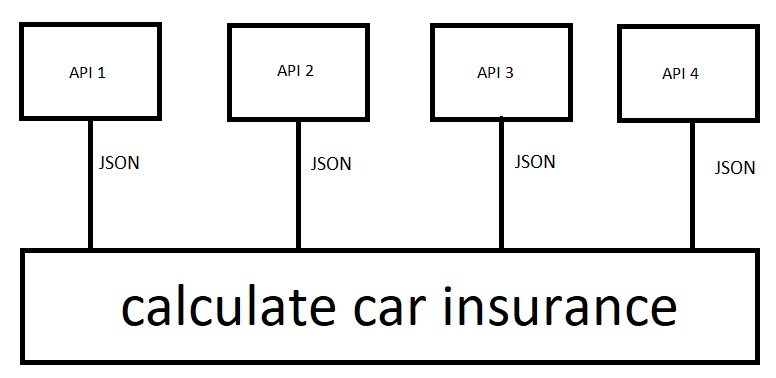

Every time when you deploy a new version of each service, automatically execute Unit Tests and E2E tests of the service but, we have a problem. We don’t try the functionality between services. For example, if API 1 create a car and API 2 calculate insurance, it’s possible that when you promote to production they are not aligned with the code (or the correct version).

## Step 1: Postman
We need to create a collection, a **Postman**. The objective it to create this collection and then export and it execute on **newman**. In this tutorial we use the **api.tfl.gov.uk** to get information about underground, buses and bikes transport service in London.
The first is create a request to get information about Victoria line.

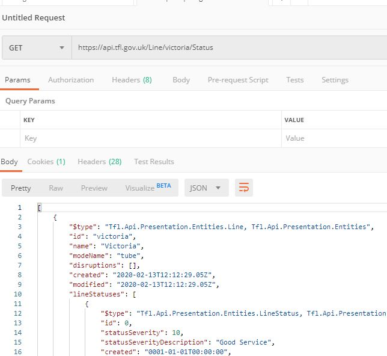

As you can see, the request is a static URL. We want to create variables to reuse them others requests. We need to create an environment.

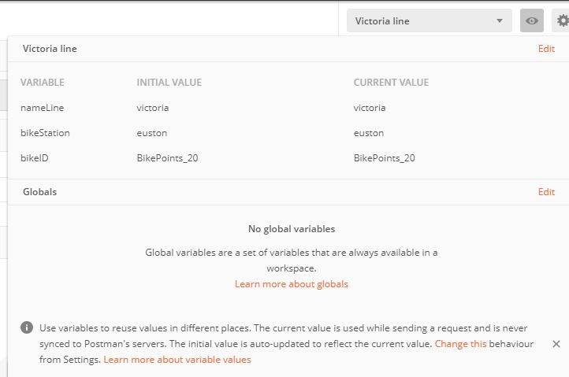

In this moment only we need the **nameLine**. Then, we need to replace value in URL.

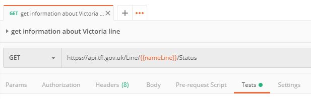

**nameLine** is Victoria and when you execute the request automatically replace **nameLine** to **Victoria**. The next step is to create the tests. We want to validate that the request **return 200 code**, id is **Victoria** and modeName is **underground line**.

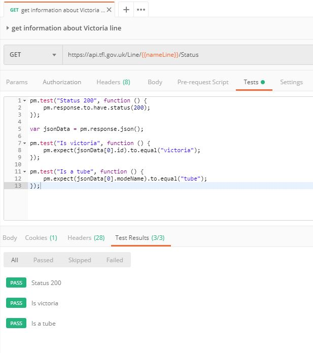

At the test is to validate 200 code. Next line is to parse the response to JSON and the next two tests are to validate that id is Victoria and nodeName is tube. This is a basic example. We want to create another request and see that it’s possible to use the same variable environment to another request.

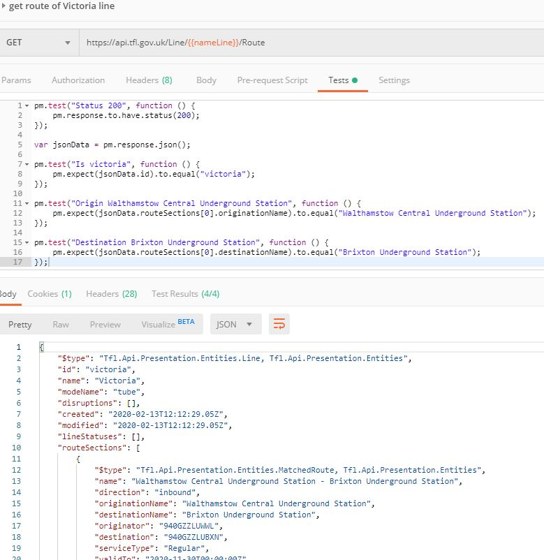

We used the same variable environment in the request.

Now we have two parametrized requests. We can change the value of nameLine to another value and the test the test is working. It’s true that we need to fix the test if we change the value of variables environment but it’s an example but the point is we can change the environment and it continues to working. To solve this problem we can create other variables in the same environment to compare the result and put them in the test.

Now we create another two request to validate how to set a value environment and use the Javascript functions in Test.

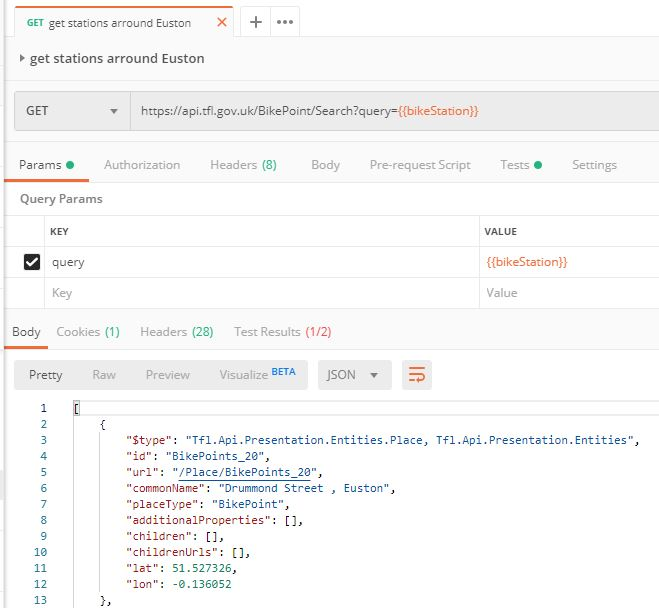

Now we want to get id, use Javascript function to validate that the request returns 8 different JSON objects (line 9) and set the **bikeID** variable environment.

**NOTE: If you don’t have bikeID variable, don’t worry, it is automatically created.**

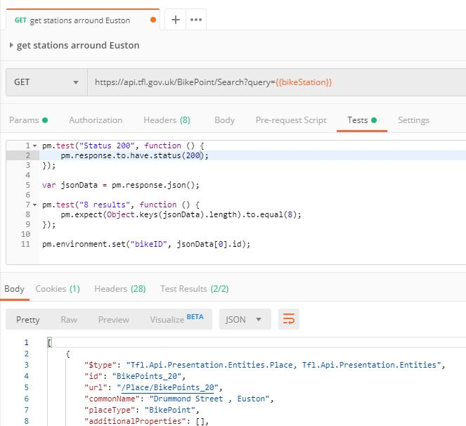

Now we put the **bikeID** value that and the last request we validate **id** and **lat** and **lon**.

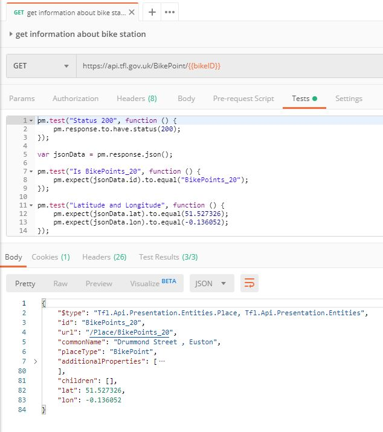

Now if we execute the tests you can see that all the process.

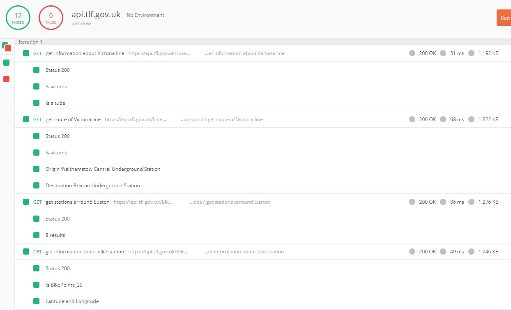

## Step 2: CI/CD
The objective is import the collection to **Newman** and execute with node command-line.

Newman is a command-line collection runner for Postman. You can execute newman directly with command-line or with Node. We will explain it with Node.

Why Node? Because it’s easy to implement Nodejs to any CI/CD (for example Jenkins).

The first step is to export the collection and variables environment to JSON.

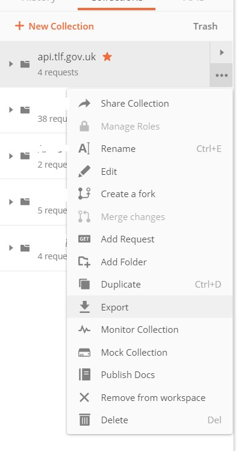

Next step is to create an npm project and to create a src folder. Then, copy and paste the collection in src folder and finally you need to modify package.json and add newman command-line.

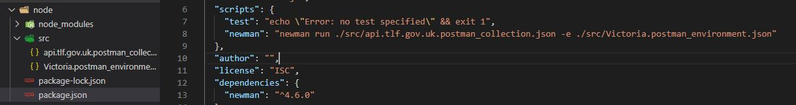

Install the packages and if you execute with npm run newman, you can see the result.

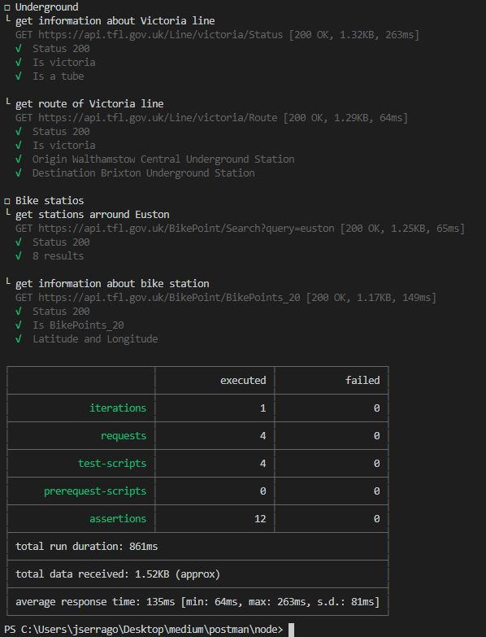
